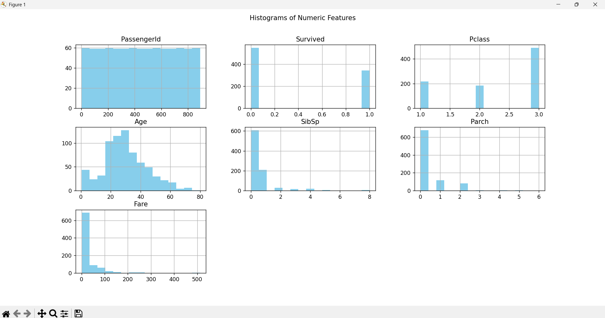
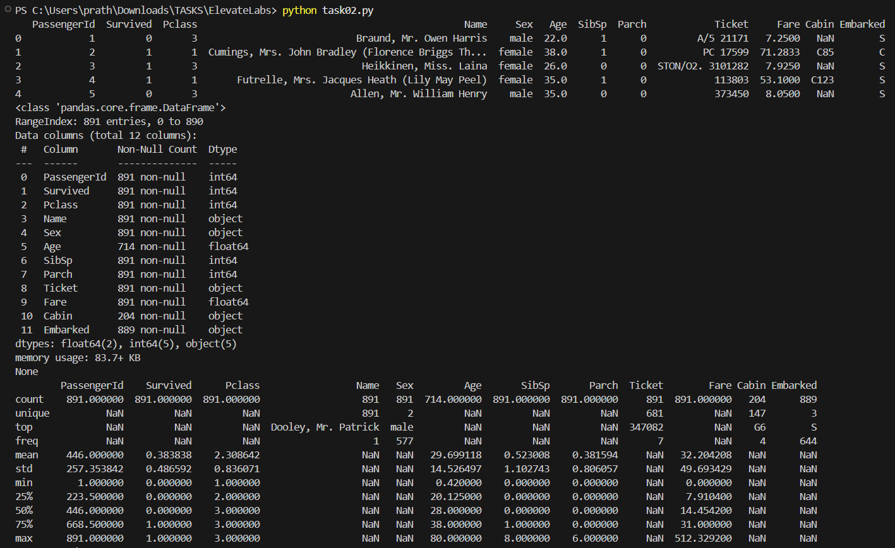
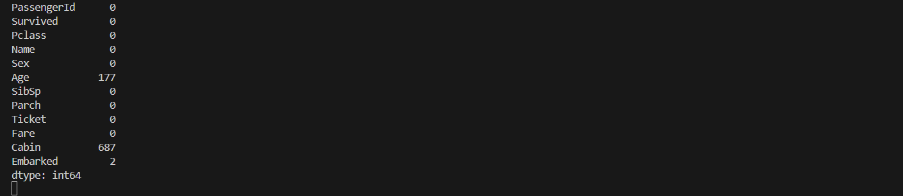

# Task 2: Exploratory Data Analysis (EDA)

## Objective
Perform exploratory data analysis on the Titanic dataset to understand patterns and feature relationships.

## Tools Used
- Python
- Pandas
- Matplotlib
- Seaborn
- Plotly

## Steps Performed
1. Loaded the Titanic dataset and checked for missing values.
2. Generated summary statistics.
3. Created histograms and boxplots for numeric features.
4. Visualized relationships using a correlation matrix and pairplot.
5. Explored categorical variables like `Sex`, `Pclass`, and `Embarked`.
6. Used Plotly for interactive charts.
7. Inferred trends and patterns from the visuals.

## How to Run
 ```bash
python task02.py
```

## Screenshot




## Dataset
You can download the Titanic dataset from [Kaggle](https://www.kaggle.com/c/titanic/data) or use the one provided here.
